# Interpreting Readability Evaluation with Explainable AI
## N8CIR Summer Internship Report

**Author:** Owais Mahmood

**Supervisors:** Nouran Khallaf (PI), Tom Hardcastle (RSE)

**Institution:** University of Leeds

---d

## 1. Aim and Context of the Project

This project investigates whether explainability methods, combined with LLM-based evaluation, can serve as a genuine evaluation framework for readability and text simplification systems. The motivation is straightforward but important: modern BERT-style classifiers and large language models are increasingly used to judge how complex a sentence is, but it is rarely clear *which* linguistic signals actually drive those judgements. Standard metrics such as accuracy or F1 score say nothing about whether a model's reasoning is linguistically sound: two models can achieve identical accuracy while attending to completely different, and differently trustworthy, parts of a sentence.

Rather than evaluating complexity classifiers purely on predictive performance, this project asks whether their *explanations*; the tokens and structures an explainability method identifies as important, actually align with the transformations a human editor makes when simplifying the same sentence. Using aligned multilingual corpora (Wikipedia-Vikidia and iDEM) that pair original sentences with their human-simplified counterparts, complete with word-level alignment and annotated simplification strategies, the project set out to answer three research questions:

1. Which tokens or linguistic features actually drive a model's prediction that a sentence is complex?

2. Do explainability methods identify the same complexity triggers that human editors modify during simplification?

3. Can LLM-as-judge evaluation help identify errors or biases in readability predictions?

The work runs on the University of Leeds' BEDE/Aire HPC cluster, since it requires repeated GPU-based inference across several transformer models, multiple attribution methods, and a large aligned corpus. The intended output is not just a set of results, but a reusable, documented framework: a reproducible codebase that others could apply to evaluate readability and simplification models beyond this specific project.

## 2. Explanation of the Assigned Tasks

The internship was structured around two main tasks, agreed with Nouran Khallaf (PI) and Tom Hardcastle (RSE) at the outset.

**Task 1: Dataset Understanding, Edit Analysis and Strategy Readiness.** 

Before any modelling work could begin, the underlying data needed to be properly understood. This meant building a data pipeline to align raw sentence pairs, source tokens, and simplification-strategy annotations from the Wikipedia-Vikidia and iDEM corpora into a single, verified dataset (1,930 aligned pairs across six languages: Arabic, Catalan, English, French, Italian, and Spanish). It also meant a substantial statistical analysis of that dataset - sentence-length changes across languages, alignment coverage, the distribution of human edit operations (keep/delete/substitute/merge/split), linguistic feature changes, and a check that the train/test/validation splits were genuinely comparable - to establish a solid, well-understood foundation for the explainability work that would follow.

**Task 2: Comparative Explainability Benchmark for Multi-label Simplification Classifiers.**

This was the core of the internship, and its scope grew substantially as the project progressed. In its final form, the task involved:

- Building a reusable framework (dataset, model, explainer, and evaluator components with a shared contract) that new models and methods could be added to without rewriting existing code

- Implementing and comparing four explainability methods -- Integrated Gradients, GradientSHAP, Raw Attention, and AttnLRP - across four different classifier models spanning three distinct architectures (BERT-family classification heads, RoBERTa-family classification heads, and a prompted/generative large language model)

- Evaluating those explanations against real human-edited spans from Task 1's aligned data, using a range of quantitative metrics (Precision@K, Recall@K, F1, AUPRC, deletion/insertion curves, attribution stability, and processing cost)

- Producing a full set of comparison tables and visualisations suitable for inclusion in a research report or paper

Task 2 was originally scoped around three models (mBERT and two QLoRA models). As the project progressed, two of those QLoRA models were found to have a genuine export problem (see Section 6) and were replaced by Nouran with XLM-R Large, Multilingual-E5 Large, and a Qwen2.5-7B prompted classifier, a change that required adapting the framework to a materially different model architecture partway through the project.

## 3. Explainability Methods and Models Used

### 3.1 Models

Four classifier models were used in the final comparison, spanning three architecturally distinct families:

| Model | Architecture | Classification approach |
|---|---|---|
| mBERT | BERT-family encoder | Standard classification head |
| XLM-R Large | RoBERTa-family encoder | Standard classification head |
| Multilingual-E5 Large | RoBERTa-family encoder | Standard classification head (requires a `"query: "` text prefix, per the model's own training convention) |
| Qwen2.5-7B (QLoRA) | Causal language model | Prompted, per-label binary classification: no classification head at all; each of the six candidate strategies is tested individually via a taxonomy-card prompt, reading the model's own next-token probability for "true" vs "false" |

All four models predict which of six simplification strategies (Synonymy, Modulation, Compression, Explanation, Syntactic Change, Omission) apply to a given source/simplified sentence pair.

### 3.2 Explainability Methods

Four explainability methods were implemented and compared:

- **Integrated Gradients**: Attributes importance by integrating the model's gradients along a straight-line path from a baseline input (all-padding tokens) to the real input, then multiplying by the input itself

- **GradientSHAP**: A Shapley-value-based approximation, averaging gradients across several randomly-perturbed baselines

- **Raw Attention**: Uses the model's own internal attention weights (specifically, attention from the classification token to every other token in the final layer) directly as an importance measure

- **AttnLRP (Attention-Aware Layer-wise Relevance Propagation)**: A more recent method (Achtibat et al., ICML 2024) that correctly propagates relevance through the non-linear operations inside self-attention, which naive gradient-based methods handle incorrectly

Not every method could be applied to every model. Integrated Gradients, GradientSHAP, and Raw Attention were implemented for all three classification-head models (mBERT, XLM-R, E5). AttnLRP required a substantial architecture-specific port (see Section 6) and was ultimately implemented for XLM-R and E5, but not mBERT or Qwen. Qwen, given its fundamentally different prompted architecture, received a purpose-built Integrated Gradients adaptation rather than the standard four-method set (see Section 6 for why the standard methods do not transfer directly to this architecture).

## 4. Implementation Process

### 4.1 Data Pipeline and Alignment (Task 1)

The first concrete piece of work was building a reliable data pipeline from the raw Wikipedia-Vikidia and iDEM source files. This produced four processed datasets:

- pair-level alignments with train/test/validation splits (1,930 pairs),
- a per-token dataset labelling each source token's edit operation (49,228 tokens),
- a classification-ready dataset (3,860 instances), and
- a split-summary table confirming the splits were reasonably balanced across languages. 

A real bug was found and fixed during this stage: document IDs had initially been drawn from a coarser, collection-level file rather than the correct sentence-level alignment file, which silently produced incorrect groupings. Once corrected, a full statistical analysis followed, covering sentence-length change, alignment coverage, the distribution of human edit operations, and split comparability - establishing that the dataset was sound before any explainability work began.

### 4.2 Framework Architecture

Task 2's framework was built around four core, swappable components, each following a shared contract so that new models or methods could be added without touching existing code:

- **Dataset adapters**: Load the test set and expose it as a consistent `Example` object (source text, simplified text, gold labels, and reference spans)

- **Model adapters**: Wrap a specific model's loading and prediction logic behind a consistent interface (`predict()`, `score()`)

- **Explainers**: Given a model and its predictions, produce per-token importance scores for a chosen label

- **Evaluators**: Given examples, predictions, and explanations, compute a metric (e.g. plausibility against gold spans, deletion/insertion curves, attribution stability)

This contract-based design proved genuinely useful: when the taxonomy changed from seven labels to six partway through the project (see Section 6), only the dataset adapter needed updating. Every explainer and evaluator downstream continued to work unchanged, since they all resolved the label list from a single shared source rather than each hard-coding their own copy.

### 4.3 Building the Explainer Methods

Integrated Gradients and GradientSHAP were implemented using Captum, Integrated Gradients using `LayerIntegratedGradients` targeting the model's embedding layer with an all-PAD baseline, and GradientSHAP using a five-sample baseline distribution around that same PAD embedding. Raw Attention was implemented by directly reading the model's final-layer attention weights from the classification token to every other token.

AttnLRP required substantially more work than the other three methods, described in detail in Section 6.

Qwen's explainer needed a different design entirely, since the model has no classification head to attribute a gradient to. Instead, the explainer reconstructs the same taxonomy-card prompt used for prediction, and computes a differentiable version of the model's own "P(true)" calculation (the probability that the model's next token is "true" rather than "false"), then applies Integrated Gradients to that scalar quantity with respect to the prompt's input embeddings.

### 4.4 Building the Evaluation Metrics

The core evaluation metric is **plausibility**: how well an explanation's highlighted tokens overlap with the real words a human editor actually changed, drawn from Task 1's word-level alignment data. Since explainers operate on sub-word tokens while the gold alignment data is word-level, this required matching tokens to gold spans via character offsets rather than direct index comparison. From this, Precision@K, Recall@K, F1, and AUPRC were computed, with K set adaptively per example to the number of real gold tokens.

Three further metrics were added to meet Nouran's comparison-table requirements: **deletion/insertion curves** (progressively masking, or progressively revealing, the top-K most important tokens and tracking how the model's predicted probability changes. A good explanation should cause a fast drop under deletion and a fast rise under insertion), **attribution stability** (re-running the same explainer under small embedding-level noise and measuring the rank correlation between the original and perturbed explanations), and **processing time / compute cost** (wall-clock time and peak GPU memory per explanation).

### 4.5 Building the Visualisations

Eight visualisation types were built, all reading from the same real evaluation data rather than illustrative or synthetic examples: token-level heatmaps, side-by-side method comparisons, bar charts, radar charts, deletion/insertion curves, strategy-level heatmaps, box plots of attribution distribution, and error-analysis examples (automatically selecting the real highest- and lowest-scoring explanations from the full results, rather than hand-picking them).

### 4.6 Full-Scale Runs

Once each component was verified, explanation and evaluation were run at full scale: 260-281 pairs (depending on which version of the test set was current at the time) for mBERT, XLM-R, and E5, across all applicable explainer methods; a 30-pair sample for Qwen given its substantially higher per-example cost; and the full 281-pair set for AttnLRP on both XLM-R and E5, which turned out to be considerably cheaper computationally than the gradient-based methods since it needs only a single backward pass per label rather than many interpolation steps.

## 5. Learning Outcomes

Coming into this internship, almost everything involved was new to me. I had Python, machine learning, and data analysis experience, but no prior background in explainability methods, and I had never worked on a research project of this kind before.

On the technical side, I gained hands-on experience with HPC computing: connecting to and working on the BEDE/Aire cluster over SSH with two-factor authentication, managing Python environments that reset between sessions, and working directly with GPU hardware, including diagnosing and resolving driver and CUDA version mismatches. I also worked properly, for the first time, with the specific libraries and techniques that make up the explainability field: Captum's Integrated Gradients and GradientSHAP implementations, raw attention extraction, and the AttnLRP method, alongside the practical realities of loading and adapting large pretrained transformer models.

More broadly, this was my first real experience of doing research. I had not done anything like this before, and the process of forming a hypothesis, testing it carefully, and being willing to be wrong and start again was new to me. The clearest example of this was the AttnLRP conservation bug: my implementation appeared to fail completely, giving results close to zero, on every model I tested it against, including a tiny dummy model and the real trained model.

Rather than assuming the method itself was simply broken, I traced the problem systematically: checking whether the patched code was actually running, checking whether gradients were vanishing, and eventually comparing my implementation directly against the official reference library under controlled conditions. That comparison showed the official implementation failed in exactly the same way, which told me the bug was not in my code at all, but in how I was testing it. Reading the official documentation's worked example closely revealed two genuine methodology errors I had been making: the backward pass needed to be seeded differently, and the correct relevance score required multiplying the gradient by the input itself rather than using the gradient alone. Fixing both took the result from completely broken to genuinely working, and outperforming every other method I had implemented.

That experience taught me more about how to approach a stubborn technical problem than almost anything else in the internship: to question my assumptions before questioning the method, and to find an independent way to test whether a problem is really where I think it is.

The project also required adapting to real, unplanned change. The label taxonomy changed partway through, the set of models changed when two of the original three were found to have a genuine export problem, and new requirements were added as the project progressed. Having a framework built around clear, shared contracts between components meant that most of these changes were manageable rather than disruptive, but it also meant learning to build software with that kind of future change in mind from the start, rather than assuming the requirements I started with would stay fixed.

## 6. Technical and Research Challenges Encountered

**AttnLRP had no library support for the RoBERTa architecture family.**

The official reference library implements AttnLRP for several architectures (including BERT), but not for RoBERTa or XLM-RoBERTa, which XLM-R and E5 are both built on. There was no existing implementation to adapt directly.

**A critical methodology bug in testing AttnLRP.**

Even after porting the method to XLM-RoBERTa, initial testing showed the implementation producing results close to zero: essentially no relevance assigned to any token, regardless of the model, the input, or the random seed used. This was a genuinely difficult problem to diagnose, since the code appeared to run correctly with no errors.

**Two of the three originally planned models had a genuine export problem.**

DeepSeek and Mistral, the two QLoRA models originally scoped for the project, both failed to produce meaningful predictions. Investigation at the file level (inspecting the actual weights stored inside each model's checkpoint) showed that neither published model repository contained the trained classification head weights at all; only the LoRA adapter weights for the base language model's attention and feed-forward layers were present. Without the classification head, any predictions from these models would have been random noise, not a reflection of anything the models had actually learned.

**Qwen's architecture does not fit the standard explainability methods.**

Unlike the other three models, Qwen has no classification head at all. It predicts each of the six candidate simplification strategies individually, using a prompted approach: a "taxonomy card" describing the strategy is inserted into the prompt, and the model's own next-token probability for "true" versus "false" is read directly. None of Integrated Gradients, GradientSHAP, or Raw Attention, as originally implemented, could be applied to this setup without significant redesign, since there was no fixed classification logit to explain.

**A range of environment and dependency conflicts.**

Across the project, several genuine compatibility issues had to be resolved: mismatches between the installed PyTorch build and the GPU driver's supported CUDA version; a newer `transformers` library version that removed functions the AttnLRP reference library depended on, requiring an isolated environment with an older, compatible version; and a `numpy` function (`np.trapz`) that had been renamed in a newer release.

## 7. How the Challenges Were Addressed

**AttnLRP's missing RoBERTa support.**

Rather than implementing the method's mathematics from scratch, the official BERT implementation was compared directly, line by line, against HuggingFace's own RoBERTa self-attention code. The two turned out to be functionally identical except for the two lines specific to AttnLRP's actual mathematical contribution: dividing the gradient at each of the two bilinear operations inside self-attention (query-key multiplication, and attention-weighted value summation) by a factor of two. This meant the already-validated BERT patch could be ported directly to RoBERTa, rather than re-deriving the method's mathematics independently, which would have carried a much higher risk of introducing a new, undetected error.

**The AttnLRP conservation bug.**

The problem was isolated through a sequence of controlled tests: first confirming that the patched code was genuinely being executed (via direct instrumentation, counting calls), then confirming that gradients were not vanishing (by tracing gradient magnitude through every layer of the network), and finally, a decisive control test comparing the implementation directly against the official library's own BERT implementation under identical conditions. Since the official implementation failed in exactly the same way, this proved the bug was in the test methodology rather than the port itself. Reading the official documentation's own worked example then revealed the two specific errors: the backward pass should be seeded with no explicit gradient argument, and the actual relevance score is the gradient multiplied by the input embedding itself, not the gradient alone. Correcting both took the conservation ratio from effectively zero to a working, sensible result.

**DeepSeek and Mistral's missing classification heads.**

This was reported clearly to Nouran with direct evidence (a full inventory of every key stored in each model's checkpoint file, showing the classification head was absent), rather than just an error message. Nouran subsequently replaced both models with XLM-R, E5, and Qwen.

**Qwen's incompatible architecture.**

A new explainer was designed specifically for Qwen's prompted approach, applying Integrated Gradients to a differentiable version of the model's own "P(true)" calculation rather than a classification logit. Since Qwen's explanations cover the entire prompt (including the taxonomy card and instructions, not just the sentence pair), a further step was needed to fairly evaluate these explanations: locating exactly where the source and simplified sentences sit within the full prompt, using the tokenizer's own character-offset mapping, so that only the relevant portion of the explanation was compared against the gold human-edit spans.

**Environment and dependency conflicts.**

Each was resolved on its own terms: reinstalling PyTorch with a build matching the GPU driver's actual supported CUDA version; setting up a separate, isolated Python environment with an older `transformers` version specifically for the AttnLRP work, so the rest of the pipeline could continue using the newer version it depended on; and adding a small compatibility check for the renamed `numpy` function.

## 8. Experimental Results and Visualisations

### 8.1 Overall Comparison

The full comparison table covers all four models and every explainer method applicable to each, evaluated on the complete final test set (281 pairs) using Precision@K, Recall@K, F1, and AUPRC against the real human-edited spans from Task 1. mBERT's legacy seventh label, Illocutionary Change, is excluded from this table, since it is not part of the current six-label taxonomy used by the other three models (its own results are reported separately in Section 9). The mean scores (Precision@K and AUPRC) were as follows.

| Model | Method | Precision@K | AUPRC |
|---|---|---|---|
| mBERT | GradientSHAP | 0.232 | 0.262 |
| mBERT | Integrated Gradients | 0.232 | 0.262 |
| mBERT | Raw Attention | 0.239 | 0.262 |
| XLM-R | AttnLRP | 0.291 | 0.331 |
| XLM-R | GradientSHAP | 0.227 | 0.270 |
| XLM-R | Integrated Gradients | 0.226 | 0.268 |
| XLM-R | Raw Attention | 0.195 | 0.234 |
| E5 | AttnLRP | 0.275 | 0.310 |
| E5 | GradientSHAP | 0.214 | 0.250 |
| E5 | Integrated Gradients | 0.214 | 0.250 |
| E5 | Raw Attention | 0.215 | 0.268 |
| Qwen | Integrated Gradients (adapted) | 0.095 | 0.108 |

This comparison spans three distinct questions, which are kept deliberately separate rather than conflated into a single ranking.

**Method comparison: which explainer works best within the same model?**

On XLM-R, AttnLRP improves Precision@K by 0.064 and AUPRC by 0.061 over the next-best method (GradientSHAP). On E5, AttnLRP improves Precision@K by 0.061 and AUPRC by 0.042 over the next-best method (Raw Attention). These margins are large relative to the spread among the other three methods on the same model, and hold consistently across nearly every simplification strategy individually (Section 8.2), not just in the overall average. For mBERT, the three applicable methods (GradientSHAP, Integrated Gradients, Raw Attention) differ by only 0.007 in Precision@K and 0.0002 in AUPRC; the current results do not support a clear winner among these three methods on mBERT without uncertainty estimates.

**Model comparison: which model produces the best edit-aligned explanations when evaluated using the same method?**

This is where care is needed, since AttnLRP was only implemented for XLM-R and E5, not mBERT or Qwen (Section 6). Comparing overall averages naively would let AttnLRP's strength be misread as XLM-R's strength. Restricting the comparison to methods every relevant model actually shares gives a different, more reliable picture: under every method common to all three encoder models -- GradientSHAP, Integrated Gradients, and Raw Attention -- mBERT scores highest, not XLM-R. XLM-R's apparent overall advantage in the table above is attributable entirely to AttnLRP being paired with it. Under Integrated Gradients specifically, the three encoder models even rank differently depending on the metric: mBERT has the highest Precision@K (0.232), while XLM-R has the highest AUPRC (0.268), so the "best model" depends on which metric is prioritised. With AttnLRP, XLM-R scores higher than E5 by 0.016 Precision@K and 0.021 AUPRC, but this comparison is valid only between these two models under AttnLRP specifically, not as a general claim about XLM-R's overall strength.

Correctly separated, this gives two independent findings rather than one conflated claim: AttnLRP is the strongest explainability method in this comparison, and mBERT is the strongest model once models are compared fairly, under a method they all share.

**Qwen's explanations align considerably less well with human edits than the encoder models' explanations do.**

Qwen's Precision@K (0.095) and AUPRC (0.108) are both well below every encoder model result, evaluated on the same complete 281-pair test set for a fair, matched comparison. The most likely explanation is architectural rather than a flaw in the explainer itself: Qwen's explanations are computed over its entire prompt, which includes a lengthy taxonomy card and instructions in addition to the sentence pair being judged, so the same total amount of "important tokens" identified by the method is spread across a much larger space, making it inherently harder to concentrate importance precisely on the sentence pair.

### 8.2 Per-Strategy Breakdown

The same metrics were computed separately for each of the six simplification strategies in the current taxonomy, together with the real number of test pairs carrying each gold label (n). mBERT's legacy seventh label, Illocutionary Change, is not part of the current taxonomy and is reported separately in Section 9, not included here.

| Strategy | n | Best method within model | Best model (methods shared by all 3 encoders) | Margin |
|---|---|---|---|---|
| Synonymy | 215 | XLM-R/AttnLRP | mBERT (3/3 shared methods) | 0.001-0.009 |
| Modulation | 150 | XLM-R/AttnLRP | XLM-R (2/3), mBERT (1/3) | 0.005-0.018 |
| Compression | 87 | XLM-R/AttnLRP | mBERT (3/3 shared methods) | 0.010-0.032 |
| Explanation | 79 | XLM-R/AttnLRP | XLM-R (2/3), mBERT (1/3) | 0.007-0.010 |
| Syntactic Change | 80 | XLM-R/AttnLRP | mBERT (3/3 shared methods) | 0.014-0.069 |
| Omission | 61 | XLM-R/AttnLRP | mBERT (3/3 shared methods) | 0.007-0.041 |

AttnLRP is the strongest method within its model (XLM-R) on every single strategy without exception, consistent with the overall pattern in Section 8.1. The model-level picture is more nuanced: mBERT wins outright on four of the six strategies (Synonymy, Compression, Syntactic Change, Omission) across every method the three encoder models share, but XLM-R actually wins on two strategies -- Modulation and Explanation -- under two of the three shared methods (GradientSHAP and Integrated Gradients), with mBERT only regaining the lead under Raw Attention specifically on those two strategies. This is a genuinely mixed result, not a uniform advantage for either model, and is only visible because model and method comparisons were kept separate (Section 8.1).

**Synonymy**

(n=215, the most frequent strategy) shows the smallest margins of any strategy (as low as 0.001 under Integrated Gradients). Synonym substitution is typically a single-word, lexically local edit, which even weaker attribution methods can localise reasonably well, leaving little room for one method or model to show a large advantage over another.

**Compression**

(n=87) shows mBERT winning clearly and consistently (margins 0.010-0.032). Compression often involves merging or shortening a short phrasal span rather than a single token, which may still be reasonably compact and localisable, consistent with mBERT's advantage holding across all three shared methods here.

**Modulation** (n=150) and **Explanation** (n=79)

are the two strategies where XLM-R outperforms mBERT under two of the three shared methods. Both strategies can involve a broader shift across the sentence -- a change in perspective or register for Modulation, inserted explanatory content for Explanation -- rather than a single local substitution, which may favour XLM-R's larger pretrained representation for capturing longer-range dependencies. This remains a specific, method-dependent finding (Raw Attention still favours mBERT even on these two strategies) rather than a general claim that XLM-R is the stronger model.

**Syntactic Change**

(n=80) shows mBERT's largest margin of any strategy under Raw Attention specifically (0.069), notably larger than its margins under GradientSHAP or Integrated Gradients on the same strategy. Syntactic restructuring may correlate more directly with attention patterns than semantic edits do, since attention naturally reflects positional and grammatical relationships between tokens, which could explain why Raw Attention performs relatively well here compared to its generally weaker showing elsewhere (Section 9).

**Omission**

(n=61, the least frequent strategy and therefore the noisiest estimate) shows mBERT winning consistently, with its largest margin under Raw Attention (0.041). Omission is, in principle, a strategy with a distinctive signal for attribution methods: the edit is defined by a span's absence rather than its replacement. The smaller sample size here means this finding should be treated with more caution than the higher-n strategies above.

### 8.3 Visualisations

Eight visualisation types were produced, all built directly from real evaluation data rather than illustrative examples.

**1. Token-level heatmaps**, showing per-token importance as coloured text (red = positive, blue = negative), for a single explanation (Integrated Gradients, mBERT):

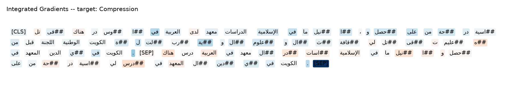

**2. Side-by-side method comparisons**, stacking the same sentence's explanation across all three mBERT methods for direct visual comparison:

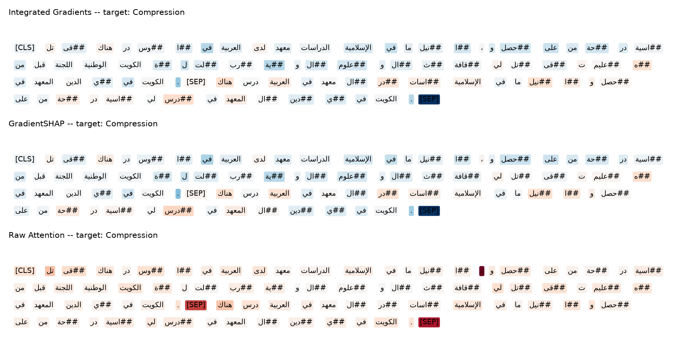

**3. Bar charts** comparing Precision@K across all methods and models:

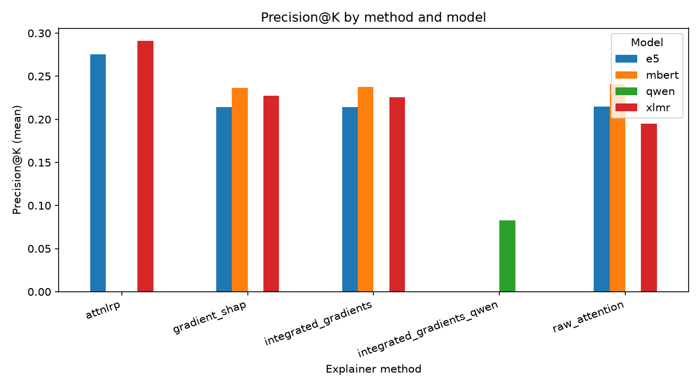

**4. Radar charts** summarising multiple evaluation dimensions (overall Precision@K, overall AUPRC, and two per-strategy scores) on a single chart per method:

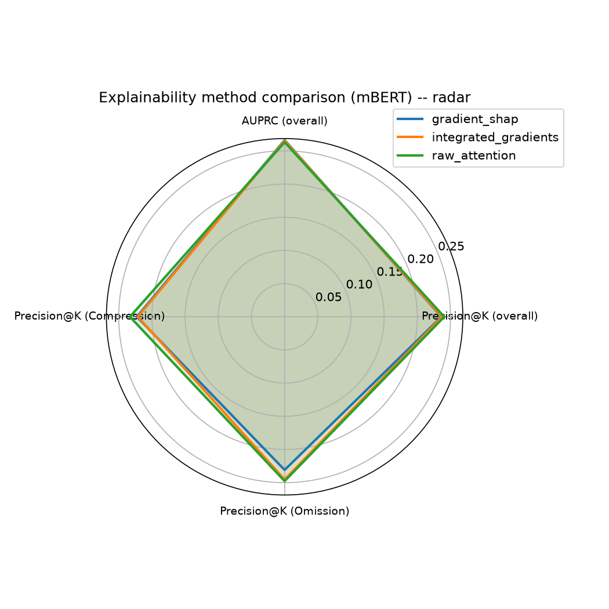

**5. Deletion and insertion curves**, tracking predicted probability as the most important tokens are progressively removed or revealed:

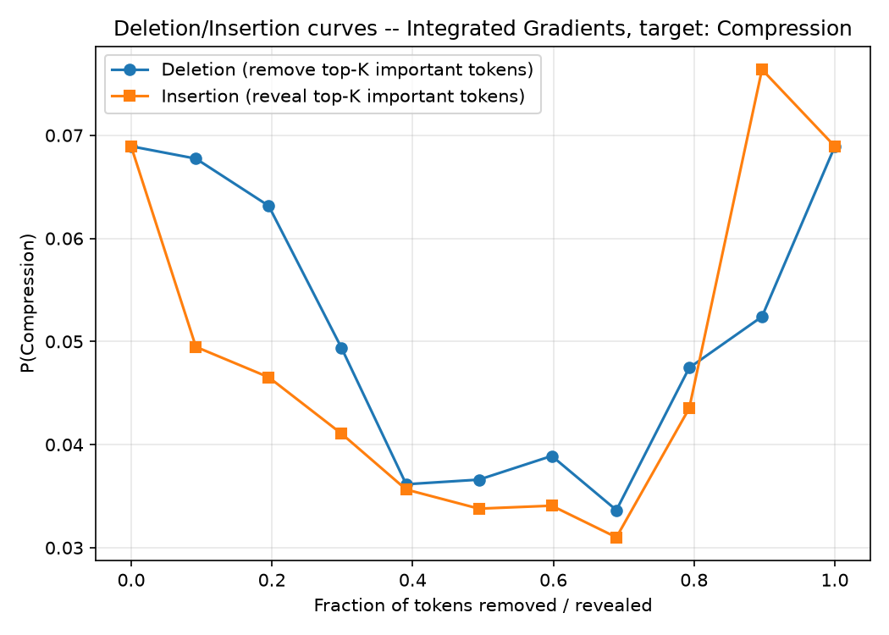

**6. Strategy-level heatmaps**, one per model, showing Precision@K for every method against every simplification strategy:

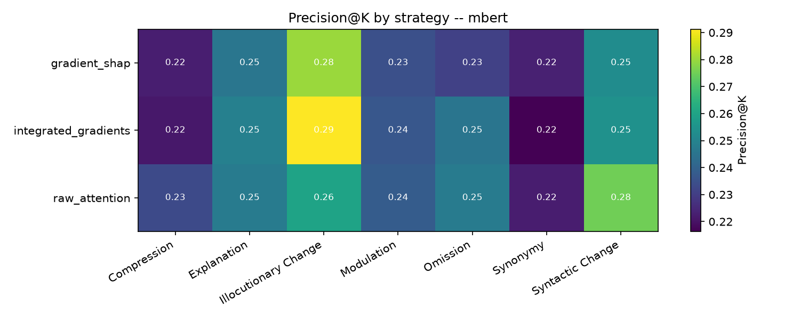

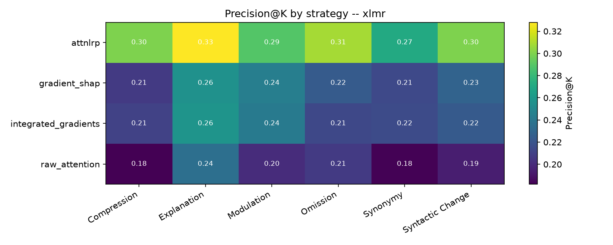

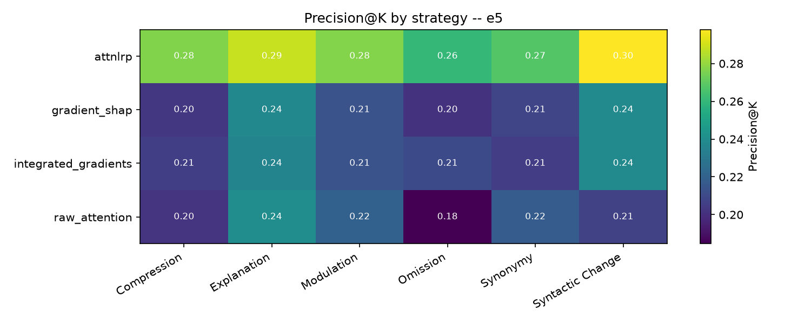

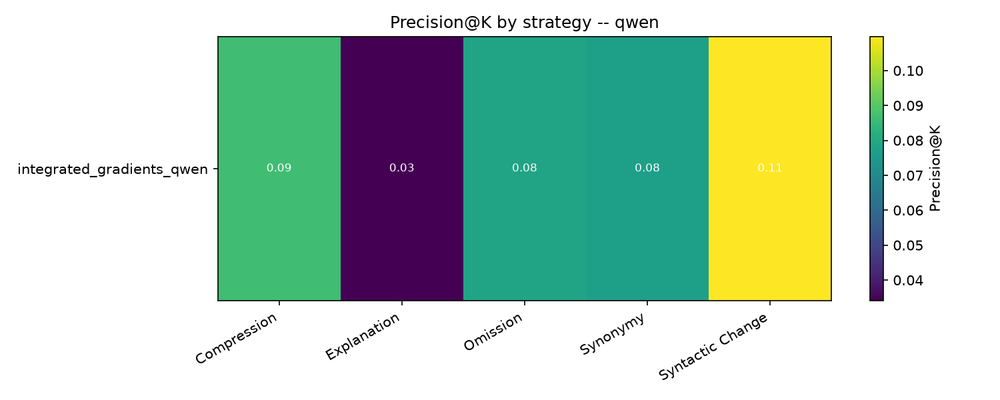

**7. Box plots** showing the distribution, not just the mean, of attribution scores for each method:

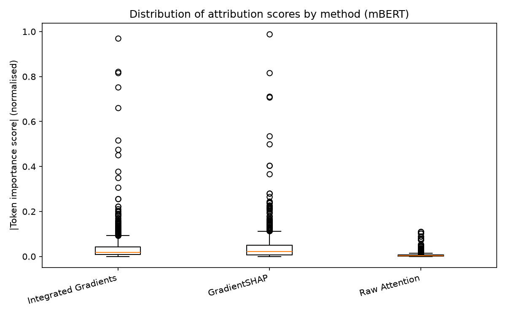

**8. Error-analysis examples**, automatically selecting the real highest- and lowest-scoring explanations from the full results to show a successful and an unsuccessful case side by side:

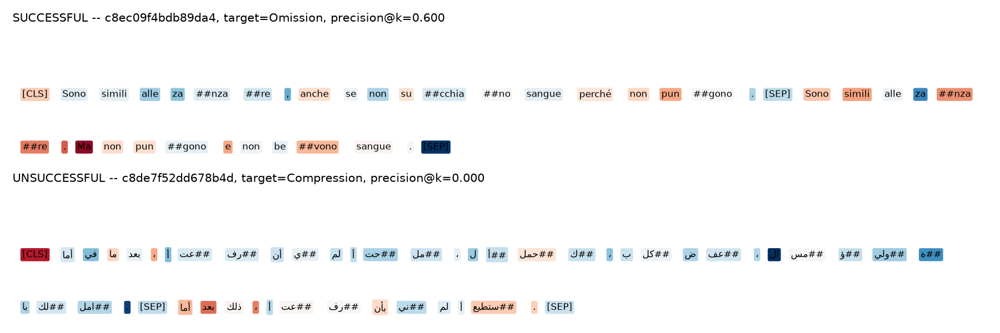

### 8.4 Processing Time and Compute Cost

Wall-clock time and peak GPU memory were measured per explanation, using consistent instrumentation across methods (Section 4.4).

| Method | Seconds per explanation | Peak GPU memory |
|---|---|---|
| Raw Attention (mBERT) | 0.017 | ~700 MB (consistent) |
| Integrated Gradients (mBERT) | 2.73 | 2-8 GB (varies with sequence length) |
| AttnLRP (XLM-R, E5) | Single backward pass per label; measured at full scale (281 pairs), completing in 185s (XLM-R) and 216s (E5) total, roughly 0.24-0.27s per explanation | Not separately profiled |
| Integrated Gradients (Qwen, adapted) | ~10s per explanation at full scale (281 pairs, 775 explanations in 2875s total) | Substantially higher, given the 7B parameter model |

Raw Attention is roughly 160 times faster than Integrated Gradients on the same model (mBERT), since it requires only a single forward pass with no gradient computation, whereas Integrated Gradients requires 50 forward-and-backward passes per explanation (one per interpolation step). AttnLRP is a notable middle ground: despite being a gradient-based method that requires backpropagation, it needs only a single backward pass per label, making it considerably cheaper than Integrated Gradients or GradientSHAP while still outperforming them on plausibility (Section 8.1). This is a genuinely useful practical property, not just an accuracy advantage: AttnLRP delivers the best results in this comparison at a fraction of the compute cost of the next most accurate gradient-based methods.

Qwen's Integrated Gradients adaptation is by far the most expensive method in this comparison, reflecting both its 7-billion-parameter size and the substantially longer input (its full prompt, including the taxonomy card, versus a single sentence pair for the encoder models).sss

## 9. Discussion of Findings and Limitations

The results in this report offer a genuine, if partial, answer to the project's original research questions. AttnLRP's consistent advantage over Integrated Gradients, GradientSHAP, and Raw Attention, across two architecturally similar but independently trained models, is the clearest finding: it suggests that correctly handling the non-linear operations inside self-attention, which is exactly what distinguishes AttnLRP from the other gradient-based methods, produces explanations that genuinely align better with where human editors actually made changes. This is a meaningful result in its own right, separate from any particular model's classification accuracy.

A second, more specific finding emerged during the XLM-R comparison: Raw Attention performed noticeably worse than the gradient-based methods on that model, and further investigation showed that Raw Attention's scores were identical regardless of which strategy label was being explained. This makes sense on reflection: attention weights are a property of the model's forward pass alone and carry no information about which output label is being predicted, whereas gradient-based methods differentiate specifically with respect to one target label's logit. This is a genuine methodological difference between the two families of method, not a flaw in either, but it does mean Raw Attention's results should be read with that limitation in mind.

Several real limitations should be acknowledged directly.

**Not every metric was evaluated at full scale.**

Precision@K, Recall@K, F1, and AUPRC were computed across the complete test set for every applicable model and method. Deletion/insertion curves, attribution stability, and processing time, by contrast, were implemented, verified against controlled synthetic tests, and confirmed working correctly on real data, but only tested on a small number of real examples rather than the full dataset, given the time available this week. The mechanisms themselves are sound; extending them to full scale would be a natural next step.

**A small number of test pairs have no evaluable label under the current taxonomy.**

When the label set changed from seven strategies to six, twelve pairs whose only gold label was either "Transposition" or "Illocutionary Change" were left without any label under the new scheme. This was raised directly and resolved by Nouran providing an updated, cleaned test set; the current results are computed against that corrected data.

**AttnLRP's conservation property is not perfectly satisfied.**

LRP methods have a theoretical property that the sum of all token relevance scores should approximately equal the model's actual output value being explained. In testing against the real trained models, this ratio came out at roughly 2.6 rather than the ideal 1.0. This is a substantial improvement over the completely broken result found before the methodology bug was fixed, and the explanations produced are clearly meaningful and outperform the other methods, but the residual gap from 1.0 suggests there may be a smaller, unresolved gap in the implementation's coverage, specific to this model's custom classification head wrapper, that would be worth investigating further.

**Qwen has only one explainer method implemented, not the full set.**

Given the substantial redesign required to adapt any explainability method to Qwen's prompted architecture at all, only an adapted version of Integrated Gradients was implemented within the time available. GradientSHAP, Raw Attention, and AttnLRP would each need their own architecture-specific adaptation to be applied to Qwen fairly.

Taken together, the project demonstrates that explainability methods can meaningfully be compared across genuinely different model architectures, that the choice of method matters (AttnLRP's advantage being the clearest evidence of this), and that doing this kind of comparison properly surfaces real, non-obvious findings, rather than confirming an assumption made in advance.

## References

Achtibat, R., Hatefi, S. M. V., Dreyer, M., Jain, A., Wiegand, T., Lapuschkin, S., & Samek, W. (2024). AttnLRP: Attention-Aware Layer-Wise Relevance Propagation for Transformers. *Proceedings of the 41st International Conference on Machine Learning*, PMLR volume 235, pages 135-168.

Conneau, A., Khandelwal, K., Goyal, N., Chaudhary, V., Wenzek, G., Guzman, F., Grave, E., Ott, M., Zettlemoyer, L., & Stoyanov, V. (2020). Unsupervised Cross-lingual Representation Learning at Scale. *Proceedings of the 58th Annual Meeting of the Association for Computational Linguistics*, pages 8440-8451.

DeYoung, J., Jain, S., Rajani, N. F., Lehman, E., Xiong, C., Socher, R., & Wallace, B. C. (2020). ERASER: A Benchmark to Evaluate Rationalized NLP Models. *Proceedings of the 58th Annual Meeting of the Association for Computational Linguistics*, pages 4443-4458.

Devlin, J., Chang, M.-W., Lee, K., & Toutanova, K. (2019). BERT: Pre-training of Deep Bidirectional Transformers for Language Understanding. *Proceedings of the 2019 Conference of the North American Chapter of the Association for Computational Linguistics: Human Language Technologies, Volume 1*, pages 4171-4186.

Jain, S., & Wallace, B. C. (2019). Attention is not Explanation. *Proceedings of the 2019 Conference of the North American Chapter of the Association for Computational Linguistics: Human Language Technologies, Volume 1*, pages 3543-3556.

Kokhlikyan, N., Miglani, V., Martin, M., Wang, E., Alsallakh, B., Reynolds, J., Melnikov, A., Kliushkina, N., Araya, C., Yan, S., & Reblitz-Richardson, O. (2020). Captum: A unified and generic model interpretability library for PyTorch. *arXiv preprint arXiv:2009.07896*.

Lundberg, S. M., & Lee, S. (2017). A Unified Approach to Interpreting Model Predictions. *Advances in Neural Information Processing Systems*, volume 30.

Sundararajan, M., Taly, A., & Yan, Q. (2017). Axiomatic Attribution for Deep Networks. *Proceedings of the 34th International Conference on Machine Learning*, PMLR volume 70, pages 3319-3328.

Wang, L., Yang, N., Huang, X., Yang, L., Majumder, R., & Wei, F. (2024). Multilingual E5 Text Embeddings: A Technical Report. *arXiv preprint arXiv:2402.05672*.

Wiegreffe, S., & Pinter, Y. (2019). Attention is not not Explanation. *Proceedings of the 2019 Conference on Empirical Methods in Natural Language Processing and the 9th International Joint Conference on Natural Language Processing (EMNLP-IJCNLP)*, pages 11-20.

Yang, A., Yang, B., Zhang, B., Hui, B., Zheng, B., Yu, B., et al. (2024). Qwen2.5 Technical Report. *arXiv preprint arXiv:2412.15115*.

*The corpus papers (Wikipedia-Vikidia, iDEM) and the Easy-to-Read strategy framework paper are pending confirmation from Nouran and will be added once identified.*